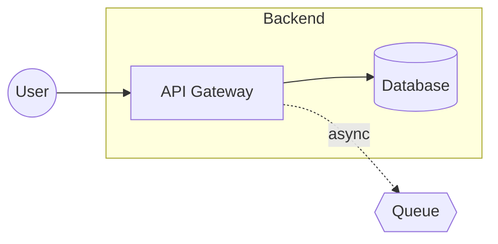
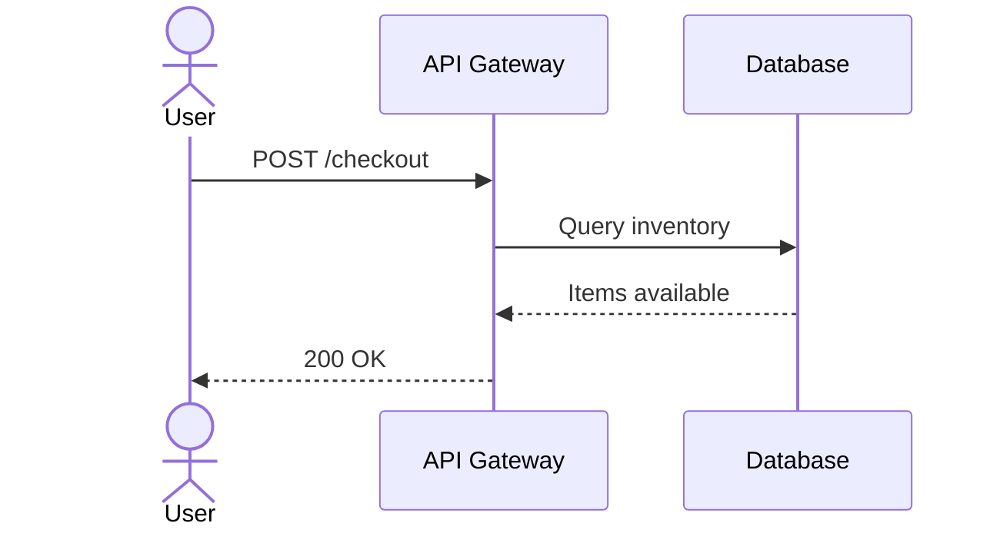
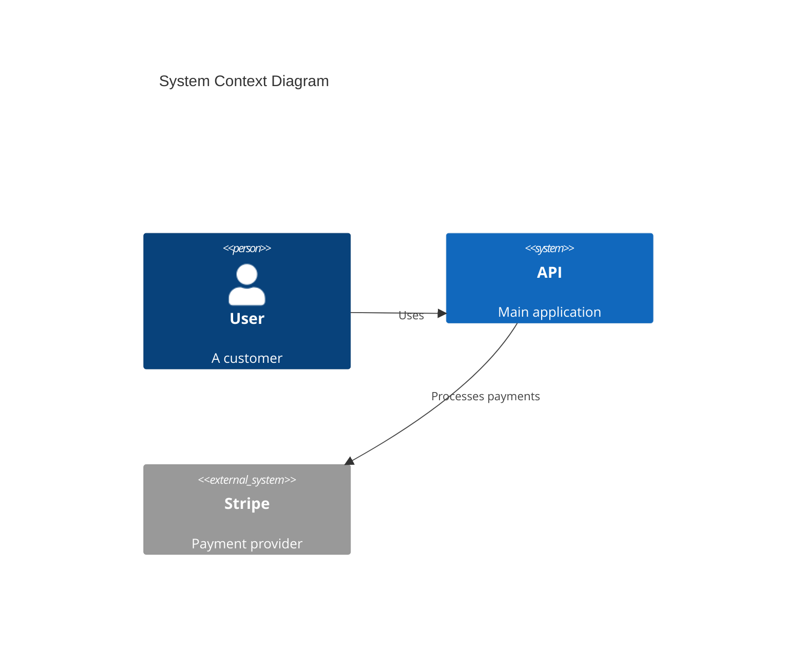

# Diagram Render

Convert a diagram spec (from `/diagram-spec`) into Excalidraw JSON or Mermaid syntax.

## Process

### Step 1: Get the Spec

Ask the user which spec to render:
- Accept a filename: `payment-service` or `payment-service.spec.json`
- Or full path: `docs/diagrams/payment-service.spec.json`
- Or let user paste the JSON directly

Look in `docs/diagrams/` for `.spec.json` files if just given a name.

### Step 2: Choose Format

Ask: **Excalidraw or Mermaid?**

- **Excalidraw** - Visual canvas, drag-and-drop editing, exports to PNG/SVG
- **Mermaid** - Text-based, version control friendly, renders in GitHub/docs

### Step 3: Generate Output

Based on format choice, generate the diagram using the embedded knowledge below.

### Step 4: Output

1. **Write the file:**
   - Excalidraw: `docs/diagrams/<name>.excalidraw`
   - Mermaid: `docs/diagrams/<name>.mmd`

2. **Show preview** if under 80 lines

3. **Provide clipboard command:**
   ```
   cat docs/diagrams/<name>.excalidraw | pbcopy
   ```

4. **Provide editor link:**
   - Excalidraw: `https://excalidraw.com` (paste JSON or import file)
   - Mermaid: `https://mermaid.live` (paste code to preview)

5. **Suggest libraries** (for Excalidraw)

---

## Excalidraw Generation

### JSON Structure

```json
{
  "type": "excalidraw",
  "version": 2,
  "source": "diagram-render",
  "elements": [...],
  "appState": {
    "gridSize": 20,
    "viewBackgroundColor": "#ffffff"
  },
  "files": {}
}
```

### Element Types

**Rectangle (service, db, queue, cache):**
```json
{
  "id": "unique-id",
  "type": "rectangle",
  "x": 100,
  "y": 100,
  "width": 160,
  "height": 80,
  "strokeColor": "#1e1e1e",
  "backgroundColor": "#a5d8ff",
  "fillStyle": "solid",
  "strokeWidth": 2,
  "roundness": { "type": 3 },
  "boundElements": [{ "id": "arrow-id", "type": "arrow" }]
}
```

**Ellipse (actor):**
```json
{
  "id": "unique-id",
  "type": "ellipse",
  "x": 100,
  "y": 100,
  "width": 80,
  "height": 80,
  "strokeColor": "#1e1e1e",
  "backgroundColor": "#b2f2bb",
  "fillStyle": "solid",
  "strokeWidth": 2
}
```

**Diamond (external):**
```json
{
  "id": "unique-id",
  "type": "diamond",
  "x": 100,
  "y": 100,
  "width": 120,
  "height": 80,
  "strokeColor": "#1e1e1e",
  "backgroundColor": "#ffec99",
  "fillStyle": "solid",
  "strokeWidth": 2
}
```

**Text (labels):**
```json
{
  "id": "text-id",
  "type": "text",
  "x": 120,
  "y": 130,
  "text": "Label Text",
  "fontSize": 16,
  "fontFamily": 1,
  "textAlign": "center",
  "verticalAlign": "middle",
  "containerId": "parent-shape-id"
}
```

**Arrow (edges):**
```json
{
  "id": "arrow-id",
  "type": "arrow",
  "x": 260,
  "y": 140,
  "width": 100,
  "height": 0,
  "strokeColor": "#1e1e1e",
  "strokeWidth": 2,
  "points": [[0, 0], [100, 0]],
  "startBinding": { "elementId": "source-id", "focus": 0, "gap": 8 },
  "endBinding": { "elementId": "target-id", "focus": 0, "gap": 8 },
  "startArrowhead": null,
  "endArrowhead": "arrow",
  "elbowed": true
}
```

**Frame (groups/views):**
```json
{
  "id": "frame-id",
  "type": "frame",
  "x": 50,
  "y": 50,
  "width": 800,
  "height": 400,
  "name": "Backend Services"
}
```

### Color Palette

Use consistent colors by node type:

| Type | Background | Meaning |
|------|------------|---------|
| actor | `#b2f2bb` (green) | Users, roles |
| service | `#a5d8ff` (blue) | APIs, apps |
| db | `#ffc9c9` (red) | Databases |
| queue | `#ffec99` (yellow) | Queues, events |
| cache | `#e5dbff` (purple) | Caches |
| external | `#868e96` (gray) | Third-party |
| browser | `#74c0fc` (light blue) | Web frontend |
| mobile | `#63e6be` (teal) | Mobile app |

### Layout Algorithm

1. **Calculate grid positions:**
   - LR layout: nodes flow left-to-right, 200px horizontal spacing
   - TB layout: nodes flow top-to-bottom, 120px vertical spacing

2. **Group handling:**
   - Create frame for each group
   - Position contained nodes inside frame
   - Add 80px padding between groups

3. **Arrow routing:**
   - Use `elbowed: true` for orthogonal connectors
   - Bind arrows to shapes via `startBinding`/`endBinding`

4. **Canvas bounds:**
   - Target 1600×900 (16:9)
   - Center content with margins

### Best Practices

- **Bind all arrows** to shapes (no floating endpoints)
- **Use frames** for logical groupings
- **Align to grid** (positions divisible by 20)
- **Consistent spacing** (200px horizontal, 120px vertical)
- **1-2 line labels** maximum
- **No overlapping** elements or text

---

## Mermaid Generation

### Flowchart Syntax



**Node shapes:**
- `[text]` - Rectangle (service)
- `[(text)]` - Cylinder (database)
- `((text))` - Circle (actor)
- `{{text}}` - Hexagon (queue)
- `>text]` - Flag (external)

**Arrow styles:**
- `-->` - Solid arrow
- `-.->` - Dashed arrow
- `-->|label|` - Arrow with label

### Sequence Diagram Syntax



**Arrow types:**
- `->>` - Solid with arrowhead
- `-->>` - Dashed with arrowhead
- `-x` - Solid with X (failure)
- `--x` - Dashed with X

### C4 Diagram Syntax



**C4 elements:**
- `Person(id, label, desc)`
- `System(id, label, desc)`
- `System_Ext(id, label, desc)`
- `Container(id, label, tech, desc)`
- `Rel(from, to, label)`

### Best Practices

- **Use subgraphs** for logical groupings
- **Keep labels short** (1-3 words)
- **Direction matters**: LR for wide diagrams, TB for tall ones
- **Consistent naming** across the diagram

---

## Library Recommendations

After generating, suggest relevant Excalidraw libraries:

### C4 Architecture (Recommended)
```
For professional C4 diagrams, import the C4 library:
https://github.com/csanz91/excalidraw-libraries (search for C4)

Or browse Excalidraw's library: Click '+' → 'Browse libraries' → search 'C4'
```

### Cloud Icons
```
AWS: Search 'AWS' in Excalidraw library browser
Azure: Search 'Azure' in Excalidraw library browser
GCP: Search 'Google Cloud' in Excalidraw library browser
```

### General Tips
```
Pro tips for polished diagrams:
1. Import a shape library before editing (+ → Browse libraries)
2. Use Align & Distribute tools (select multiple → right-click)
3. Export with 'Embed scene' enabled for editable PNG/SVG
4. Keep consistent stroke widths (1-2px) and colors
```

---

## Example Output

```
Written to: docs/diagrams/checkout-flow.excalidraw

Preview (truncated):
{
  "type": "excalidraw",
  "version": 2,
  "elements": [
    {"id": "user", "type": "ellipse", ...},
    ...
  ]
}

Copy to clipboard:
cat docs/diagrams/checkout-flow.excalidraw | pbcopy

Open in Excalidraw:
https://excalidraw.com
(Import the file or paste the JSON)

Recommended: Import the C4 library for professional shapes.
```
