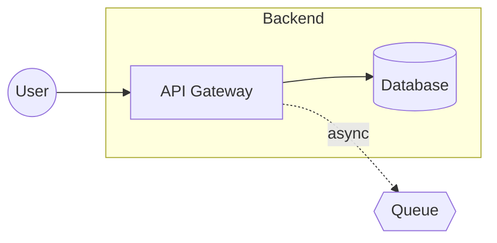
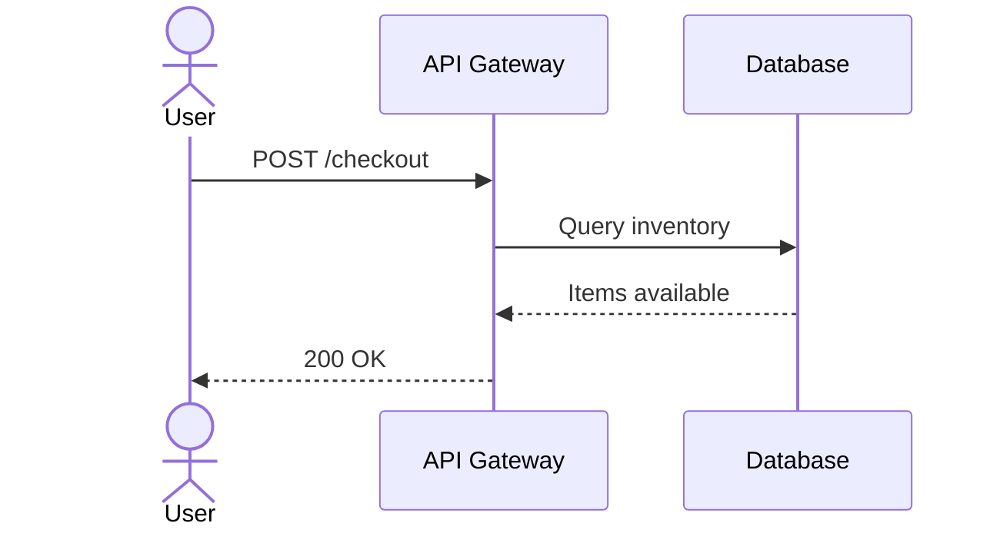
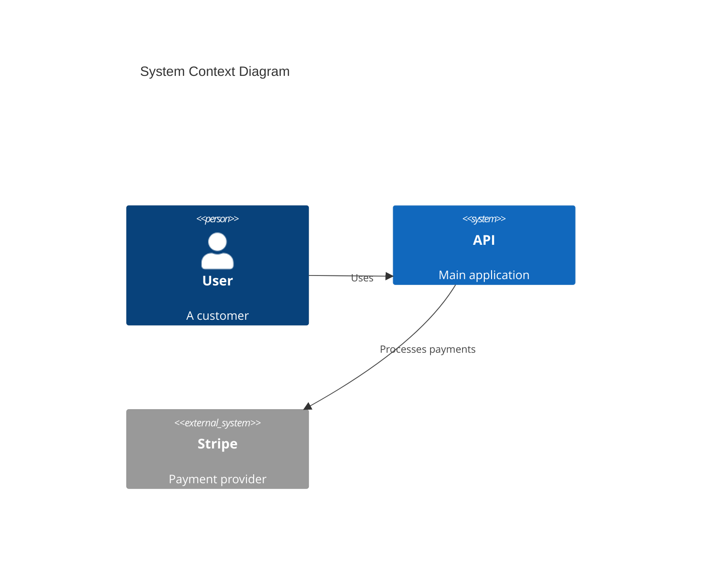
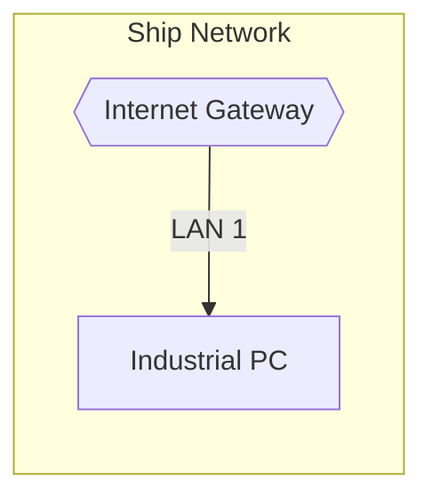
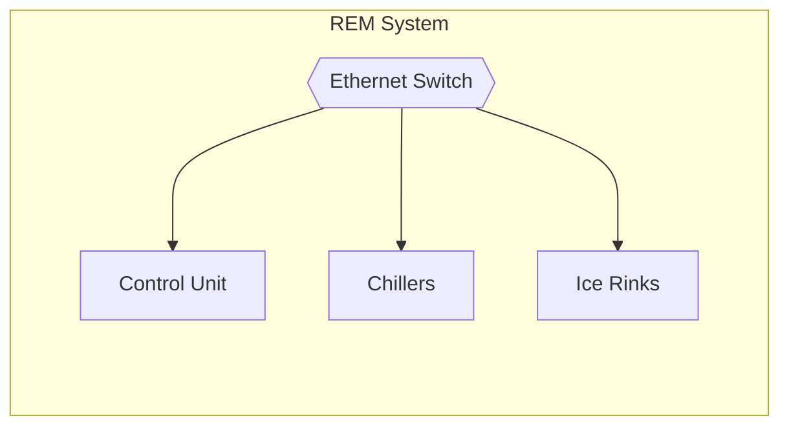

# Diagram Render

Convert a diagram spec (from `/diagram-spec`) into Excalidraw JSON or Mermaid syntax.

## Process

### Step 1: Get the Spec

Ask the user which spec to render:
- Accept a filename: `payment-service` or `payment-service.spec.json`
- Or full path: `docs/diagrams/payment-service.spec.json`
- Or let user paste the JSON directly

Look in `docs/diagrams/` for `.spec.json` files if just given a name.

### Step 2: Choose Format

Ask: **Excalidraw, Mermaid, or Kroki?**

- **Excalidraw** - Visual canvas, drag-and-drop editing, exports to PNG/SVG
- **Mermaid** - Text-based, version control friendly, renders in GitHub/docs
- **Kroki** - Unified API supporting 27+ diagram types (Mermaid, PlantUML, C4, D2, GraphViz, etc.)

### Step 3: Generate Output

Based on format choice, generate the diagram using the embedded knowledge below.

### Step 4: Output

1. **Write the file:**
   - Excalidraw: `docs/diagrams/<name>.excalidraw`
   - Mermaid: `docs/diagrams/<name>.mmd`
   - Kroki: `docs/diagrams/<name>.{mmd|puml|d2}` (source format)

2. **Show preview** if under 80 lines

3. **Provide clipboard command:**
   ```
   cat docs/diagrams/<name>.excalidraw | pbcopy
   ```

4. **Provide editor/viewer link:**
   - Excalidraw: `https://excalidraw.com` (paste JSON or import file)
   - Mermaid: Generate a mermaid.live direct link (see Direct Links section)
   - Kroki: Generate a kroki.io direct link (see Direct Links section)

5. **For Kroki, also provide:**
   - SVG URL: `https://kroki.io/{type}/svg/{encoded}`
   - Markdown embed: ``

6. **Suggest libraries** (for Excalidraw)

---

## Excalidraw Generation

### JSON Structure

```json
{
  "type": "excalidraw",
  "version": 2,
  "source": "diagram-render",
  "elements": [...],
  "appState": {
    "gridSize": 20,
    "viewBackgroundColor": "#ffffff"
  },
  "files": {}
}
```

### Element Types

**Rectangle (service, db, queue, cache):**

> ⚠️ **CRITICAL**: Include ALL properties shown below. Missing properties cause rendering failures.

```json
{
  "id": "unique-id",
  "type": "rectangle",
  "x": 100,
  "y": 100,
  "width": 160,
  "height": 80,
  "angle": 0,
  "strokeColor": "#1e1e1e",
  "backgroundColor": "#a5d8ff",
  "fillStyle": "solid",
  "strokeWidth": 2,
  "roughness": 0,
  "opacity": 100,
  "seed": 123456,
  "version": 1,
  "versionNonce": 123456789,
  "isDeleted": false,
  "groupIds": [],
  "frameId": null,
  "roundness": null,
  "boundElements": [
    { "id": "text-id", "type": "text" },
    { "id": "arrow-id", "type": "arrow" }
  ],
  "updated": 1700000000000,
  "link": null,
  "locked": false
}
```

**Styling options:**
- `"roundness": null` → Sharp corners (professional)
- `"roundness": { "type": 3 }` → Rounded corners (sketchy)
- `"roughness": 0` → Clean lines (professional)
- `"roughness": 1` → Hand-drawn look

**Ellipse (actor):**
```json
{
  "id": "unique-id",
  "type": "ellipse",
  "x": 100,
  "y": 100,
  "width": 80,
  "height": 80,
  "strokeColor": "#1e1e1e",
  "backgroundColor": "#b2f2bb",
  "fillStyle": "solid",
  "strokeWidth": 2
}
```

**Diamond (external):**
```json
{
  "id": "unique-id",
  "type": "diamond",
  "x": 100,
  "y": 100,
  "width": 120,
  "height": 80,
  "strokeColor": "#1e1e1e",
  "backgroundColor": "#ffec99",
  "fillStyle": "solid",
  "strokeWidth": 2
}
```

**Text (labels):**

> ⚠️ **CRITICAL**: For text inside shapes, BOTH the container and text must reference each other:
> - Container needs: `"boundElements": [{ "id": "text-id", "type": "text" }]`
> - Text needs: `"containerId": "parent-shape-id"`

```json
{
  "id": "text-id",
  "type": "text",
  "x": 120,
  "y": 130,
  "width": 140,
  "height": 25,
  "angle": 0,
  "text": "Label Text",
  "fontSize": 16,
  "fontFamily": 2,
  "textAlign": "center",
  "verticalAlign": "middle",
  "strokeColor": "#1e1e1e",
  "backgroundColor": "transparent",
  "fillStyle": "solid",
  "strokeWidth": 2,
  "roughness": 0,
  "opacity": 100,
  "seed": 234567,
  "version": 1,
  "versionNonce": 234567890,
  "isDeleted": false,
  "groupIds": [],
  "frameId": null,
  "roundness": null,
  "boundElements": [],
  "updated": 1700000000000,
  "link": null,
  "locked": false,
  "containerId": "parent-shape-id",
  "originalText": "Label Text",
  "autoResize": true,
  "lineHeight": 1.25
}
```

**Font options:**
- `"fontFamily": 2` → Helvetica (professional, recommended)
- `"fontFamily": 1` → Virgil (hand-drawn, sketchy)

**Arrow (edges):**

> ⚠️ **CRITICAL**: Arrows must be bound to shapes. The target shapes must also list the arrow in their `boundElements` array.

```json
{
  "id": "arrow-id",
  "type": "arrow",
  "x": 260,
  "y": 140,
  "width": 100,
  "height": 0,
  "angle": 0,
  "strokeColor": "#1e1e1e",
  "backgroundColor": "transparent",
  "fillStyle": "solid",
  "strokeWidth": 2,
  "roughness": 0,
  "opacity": 100,
  "seed": 345678,
  "version": 1,
  "versionNonce": 345678901,
  "isDeleted": false,
  "groupIds": [],
  "frameId": null,
  "roundness": { "type": 2 },
  "boundElements": [],
  "updated": 1700000000000,
  "link": null,
  "locked": false,
  "points": [[0, 0], [100, 0]],
  "startBinding": { "elementId": "source-id", "focus": 0, "gap": 8 },
  "endBinding": { "elementId": "target-id", "focus": 0, "gap": 8 },
  "startArrowhead": null,
  "endArrowhead": "arrow",
  "elbowed": true
}
```

**Arrow binding checklist:**
1. Arrow has `startBinding.elementId` pointing to source shape
2. Arrow has `endBinding.elementId` pointing to target shape
3. Source shape has `{ "id": "arrow-id", "type": "arrow" }` in its `boundElements`
4. Target shape has `{ "id": "arrow-id", "type": "arrow" }` in its `boundElements`

**Frame (groups/views):**
```json
{
  "id": "frame-id",
  "type": "frame",
  "x": 50,
  "y": 50,
  "width": 800,
  "height": 400,
  "name": "Backend Services"
}
```

### Color Palette

Use consistent colors by node type:

| Type | Background | Meaning |
|------|------------|---------|
| actor | `#b2f2bb` (green) | Users, roles |
| service | `#a5d8ff` (blue) | APIs, apps |
| db | `#ffc9c9` (red) | Databases |
| queue | `#ffec99` (yellow) | Queues, events |
| cache | `#e5dbff` (purple) | Caches |
| external | `#868e96` (gray) | Third-party |
| browser | `#74c0fc` (light blue) | Web frontend |
| mobile | `#63e6be` (teal) | Mobile app |

### Layout Algorithm

1. **Calculate grid positions:**
   - LR layout: nodes flow left-to-right, 200px horizontal spacing
   - TB layout: nodes flow top-to-bottom, 120px vertical spacing

2. **Group handling:**
   - Create frame for each group
   - Position contained nodes inside frame
   - Add 80px padding between groups

3. **Arrow routing:**
   - Use `elbowed: true` for orthogonal connectors
   - Bind arrows to shapes via `startBinding`/`endBinding`

4. **Canvas bounds:**
   - Target 1600×900 (16:9)
   - Center content with margins

### Best Practices

- **Bind all arrows** to shapes (no floating endpoints)
- **Use frames** for logical groupings
- **Align to grid** (positions divisible by 20)
- **Consistent spacing** (200px horizontal, 120px vertical)
- **1-2 line labels** maximum
- **No overlapping** elements or text

---

## Mermaid Generation

### Flowchart Syntax



**Node shapes:**
- `[text]` - Rectangle (service)
- `[(text)]` - Cylinder (database)
- `((text))` - Circle (actor)
- `{{text}}` - Hexagon (queue)
- `>text]` - Flag (external)

**Arrow styles:**
- `-->` - Solid arrow
- `-.->` - Dashed arrow
- `-->|label|` - Arrow with label

### Sequence Diagram Syntax



**Arrow types:**
- `->>` - Solid with arrowhead
- `-->>` - Dashed with arrowhead
- `-x` - Solid with X (failure)
- `--x` - Dashed with X

### C4 Diagram Syntax



**C4 elements:**
- `Person(id, label, desc)`
- `System(id, label, desc)`
- `System_Ext(id, label, desc)`
- `Container(id, label, tech, desc)`
- `Rel(from, to, label)`

### Subgraph Layout Control

> ⚠️ **CRITICAL**: Connections inside subgraphs can unexpectedly expand them. Use these techniques for predictable layouts.

**Direction inside subgraphs:**

- Use `direction TB` or `direction LR` inside subgraphs to control internal layout
- This is independent of the main flowchart direction

**Invisible subgraphs for horizontal grouping:**

- Create invisible nested subgraphs to force horizontal alignment
- Style with `fill:none,stroke:none` to hide the container

**Connection placement:**
- Place main inter-group connections OUTSIDE subgraphs to prevent expansion
- Only place connections INSIDE subgraphs for internal flows

### Best Practices

- **Use subgraphs** for logical groupings
- **Keep labels short** (1-3 words)
- **Direction matters**: TB for architecture diagrams (cloud→device→subsystems), LR for process flows
- **Consistent naming** across the diagram
- **Avoid connections inside subgraphs** unless showing internal flow
- **Use `direction` inside subgraphs** to control internal node arrangement

---

## Kroki Generation

[Kroki](https://kroki.io) is a unified diagram API supporting 27+ diagram types with instant URL generation.

### Supported Diagram Types

| Type | Kroki ID | Best For |
|------|----------|----------|
| Mermaid | `mermaid` | Flowcharts, sequence, ER diagrams |
| PlantUML | `plantuml` | UML, activity, state diagrams |
| C4 PlantUML | `c4plantuml` | C4 architecture diagrams |
| Structurizr | `structurizr` | C4 with Structurizr DSL |
| D2 | `d2` | Modern architecture diagrams |
| GraphViz | `graphviz` | Graph layouts, dependency trees |
| Excalidraw | `excalidraw` | Whiteboard-style diagrams |
| Ditaa | `ditaa` | ASCII art to diagrams |
| ERD | `erd` | Entity-relationship diagrams |
| BPMN | `bpmn` | Business process modeling |

### Output Formats

| Format | Extension | Notes |
|--------|-----------|-------|
| `svg` | .svg | Best quality, scalable (default) |
| `png` | .png | Raster, good for embedding |
| `pdf` | .pdf | Print-ready (limited support) |

### URL Format

```
https://kroki.io/{type}/{format}/{encoded-diagram}
```

Examples:
- `https://kroki.io/mermaid/svg/{encoded}`
- `https://kroki.io/c4plantuml/png/{encoded}`
- `https://kroki.io/d2/svg/{encoded}`

### Encoding Algorithm

1. Compress diagram source with deflate (level 9)
2. Encode to URL-safe base64 (`+` → `-`, `/` → `_`)

**Python:**
```python
import base64, zlib

def kroki_encode(diagram: str) -> str:
    compressed = zlib.compress(diagram.encode('utf-8'), 9)
    return base64.urlsafe_b64encode(compressed).decode('ascii')

def kroki_url(diagram: str, dtype: str = "mermaid", fmt: str = "svg") -> str:
    return f"https://kroki.io/{dtype}/{fmt}/{kroki_encode(diagram)}"
```

**Bash:**
```bash
cat diagram.mmd | python3 -c "
import sys,base64,zlib
d=sys.stdin.read().encode('utf-8')
print(base64.urlsafe_b64encode(zlib.compress(d,9)).decode())
" | xargs -I {} echo "https://kroki.io/mermaid/svg/{}"
```

### C4 with PlantUML

For C4 architecture diagrams, use `c4plantuml`:

```plantuml
@startuml
!include https://raw.githubusercontent.com/plantuml-stdlib/C4-PlantUML/master/C4_Context.puml

Person(user, "User", "A customer")
System(api, "API", "Main application")
System_Ext(stripe, "Stripe", "Payment provider")

Rel(user, api, "Uses")
Rel(api, stripe, "Processes payments")
@enduml
```

### D2 (Modern Alternative)

D2 is a modern diagram language with cleaner syntax:

```d2
direction: right

user: User {
  shape: person
}

api: API Gateway {
  shape: rectangle
  style.fill: "#a5d8ff"
}

db: Database {
  shape: cylinder
  style.fill: "#ffc9c9"
}

user -> api: HTTPS
api -> db: SQL
```

### Kroki vs Mermaid.live

| Feature | Kroki | Mermaid.live |
|---------|-------|--------------|
| Diagram types | 27+ | Mermaid only |
| Direct image URL | ✅ `/svg/` returns image | ❌ Editor only |
| Embed in markdown | ✅ `` | ❌ |
| Self-hostable | ✅ Docker | ❌ |
| Edit diagram | ❌ View only | ✅ Full editor |

**Use Kroki when:** You need direct image URLs, multiple diagram types, or markdown embedding.

**Use Mermaid.live when:** You want an interactive editor for Mermaid diagrams.

---

## Library Recommendations

After generating, suggest relevant Excalidraw libraries:

### C4 Architecture (Recommended)
```
For professional C4 diagrams, import the C4 library:
https://github.com/csanz91/excalidraw-libraries (search for C4)

Or browse Excalidraw's library: Click '+' → 'Browse libraries' → search 'C4'
```

### Cloud Icons
```
AWS: Search 'AWS' in Excalidraw library browser
Azure: Search 'Azure' in Excalidraw library browser
GCP: Search 'Google Cloud' in Excalidraw library browser
```

### General Tips
```
Pro tips for polished diagrams:
1. Import a shape library before editing (+ → Browse libraries)
2. Use Align & Distribute tools (select multiple → right-click)
3. Export with 'Embed scene' enabled for editable PNG/SVG
4. Keep consistent stroke widths (1-2px) and colors
```

---

## Example Output

```
Written to: docs/diagrams/checkout-flow.excalidraw

Preview (truncated):
{
  "type": "excalidraw",
  "version": 2,
  "elements": [
    {"id": "user", "type": "ellipse", ...},
    ...
  ]
}

Copy to clipboard:
cat docs/diagrams/checkout-flow.excalidraw | pbcopy

Open in Excalidraw:
https://excalidraw.com
(Import the file or paste the JSON)

Recommended: Import the C4 library for professional shapes.
```

---

## Common Pitfalls

### Excalidraw

| Problem | Cause | Fix |
|---------|-------|-----|
| Text not showing inside shapes | Missing bidirectional binding | Container needs `boundElements` with text ID; text needs `containerId` |
| Arrows floating/not connected | Missing binding on target shapes | Both source and target shapes need the arrow in their `boundElements` |
| Elements not rendering | Missing required properties | Include ALL properties: `angle`, `seed`, `opacity`, `roughness`, `groupIds`, `frameId`, `version`, `versionNonce`, `isDeleted`, `updated`, `link`, `locked` |
| Sketchy/unprofessional look | Default hand-drawn settings | Use `fontFamily: 2` (Helvetica), `roughness: 0`, `roundness: null` |
| Font inconsistency | Mixed fontFamily values | Set `fontFamily: 2` on ALL text elements |

### Mermaid

| Problem | Cause | Fix |
|---------|-------|-----|
| Subgraph unexpectedly large | Connections inside expand the box | Move inter-group connections outside subgraphs |
| Asymmetric layout | No direction control | Add `direction TB` or `direction LR` inside subgraphs |
| Nodes not aligned horizontally | Default vertical stacking | Use invisible nested subgraph with `direction LR` and `style fill:none,stroke:none` |
| Wrong flow direction | Incorrect main direction | Use `flowchart TB` for architecture (top-down), `flowchart LR` for processes |

### General

- **Always validate output**: Open in Excalidraw.com or Mermaid.live to verify rendering
- **Test text visibility**: Ensure all labels are readable and positioned correctly
- **Check arrow connectivity**: Verify arrows attach to shapes, not floating in space

---

## Direct Links (URL Embedding)

### Mermaid.live Direct Links

Generate shareable URLs with diagram data embedded directly in the link.

**URL formats:**
- Edit mode: `https://mermaid.live/edit#pako:<compressed>`
- View mode: `https://mermaid.live/view#pako:<compressed>`

**Python generation:**
```python
import base64, json, zlib

def mermaid_live_url(code: str, mode: str = "edit") -> str:
    """Generate a mermaid.live URL with embedded diagram."""
    payload = {"code": code, "mermaid": {"theme": "default"}}
    compress = zlib.compressobj(9, zlib.DEFLATED, 15, 8, zlib.Z_DEFAULT_STRATEGY)
    compressed = compress.compress(json.dumps(payload).encode()) + compress.flush()
    b64 = base64.b64encode(compressed).decode("ascii")
    encoded = b64.replace("+", "-").replace("/", "_")
    return f"https://mermaid.live/{mode}#pako:{encoded}"
```

**Bash one-liner (requires python3):**
```bash
cat diagram.mmd | python3 -c "
import sys,base64,json,zlib
code=sys.stdin.read()
payload=json.dumps({'code':code,'mermaid':{'theme':'default'}})
c=zlib.compressobj(9,zlib.DEFLATED,15,8,zlib.Z_DEFAULT_STRATEGY)
d=c.compress(payload.encode())+c.flush()
e=base64.b64encode(d).decode().replace('+','-').replace('/','_')
print(f'https://mermaid.live/edit#pako:{e}')
"
```

### Kroki (Alternative - Multiple Diagram Types)

[Kroki](https://kroki.io) provides a unified API for multiple diagram types.

**URL format:**
```
https://kroki.io/{type}/{format}/{encoded}
```

**Supported types:** mermaid, graphviz, plantuml, c4plantuml, ditaa, and more

**Bash encoding:**
```bash
cat diagram.mmd | python3 -c "
import sys,base64,zlib
print(base64.urlsafe_b64encode(zlib.compress(sys.stdin.read().encode(),9)).decode())
" | xargs -I {} echo "https://kroki.io/mermaid/svg/{}"
```

### Excalidraw

Excalidraw doesn't support direct URL embedding like Mermaid. Options:
1. **Manual**: Open excalidraw.com → Import file or paste JSON
2. **Collaborative**: Use excalidraw.com sharing (creates hosted link with encryption)
3. **Self-hosted**: Deploy your own instance with the `@excalidraw/excalidraw` package
